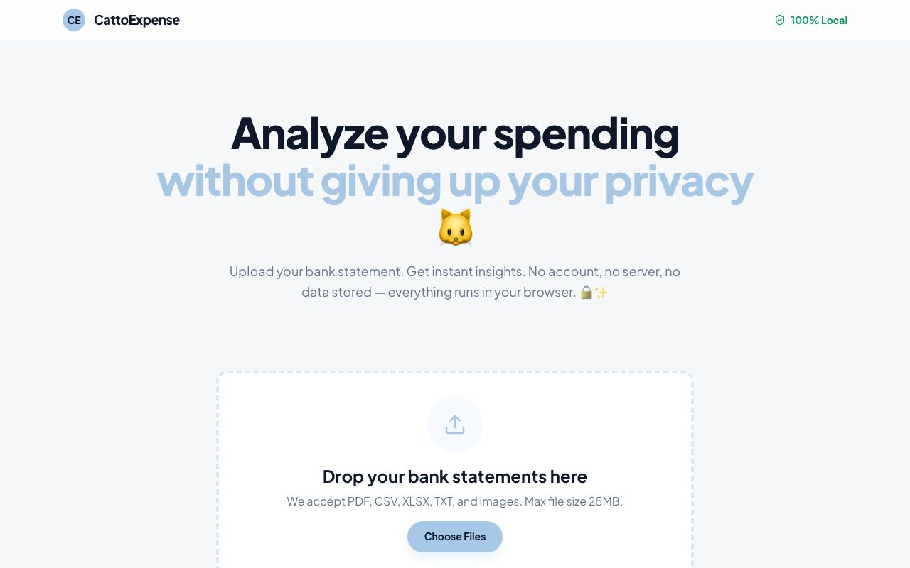
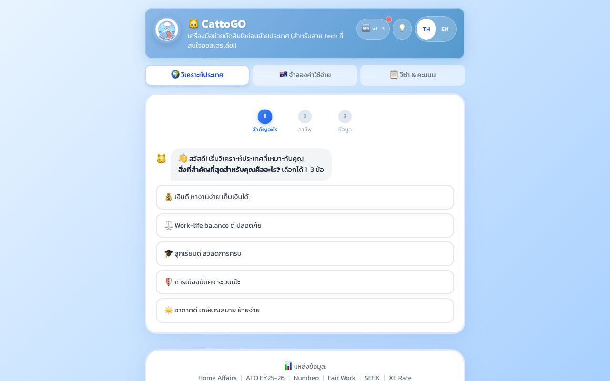
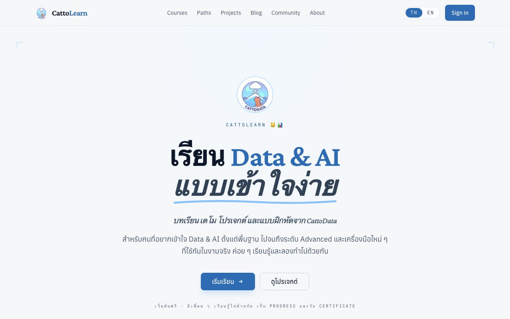
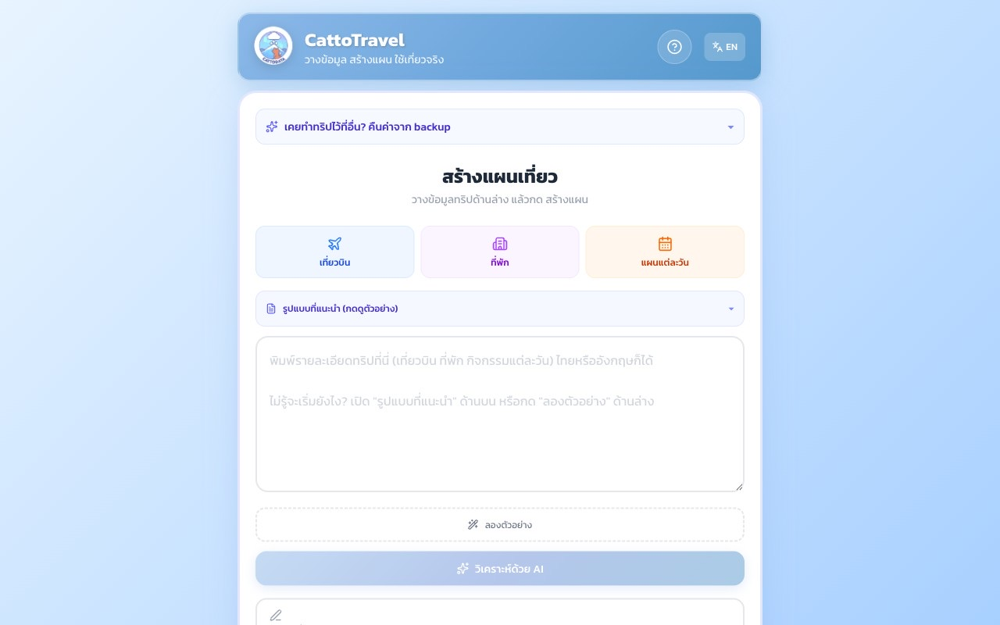
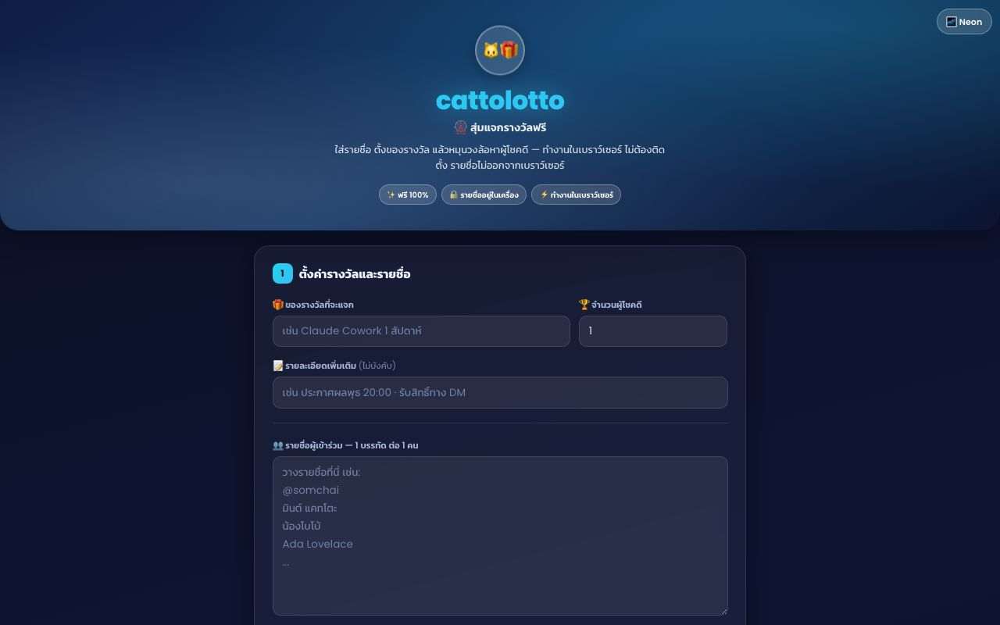
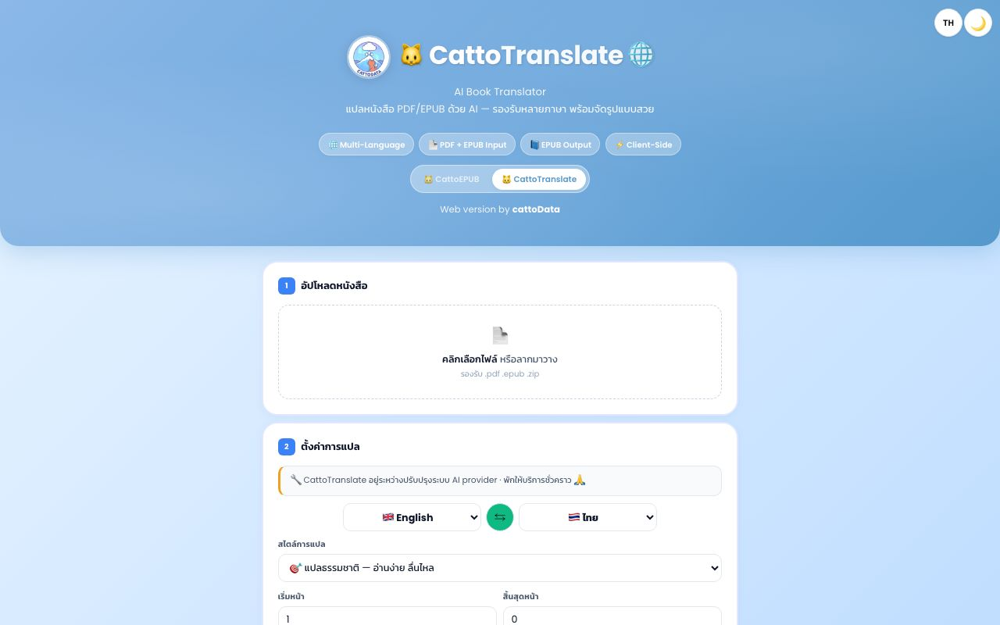
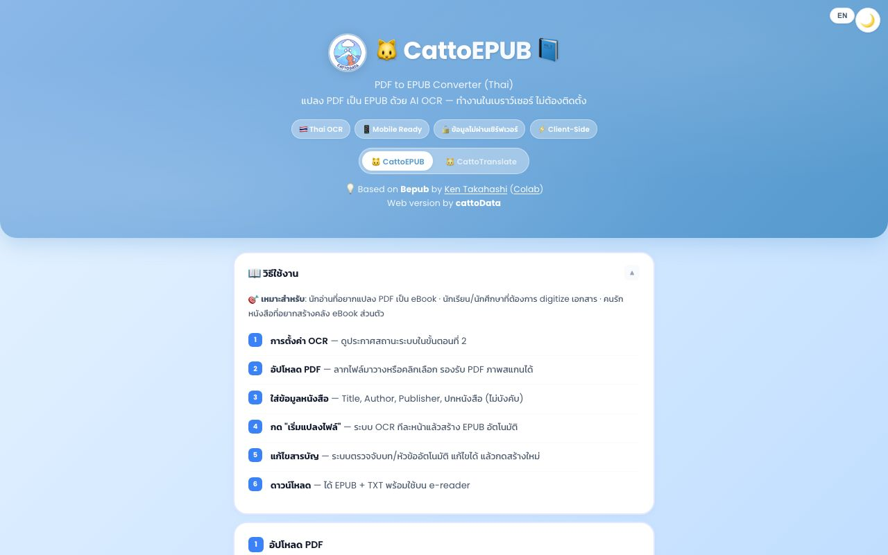

# Azure Data & AI Engineer · ex-Microsoft

### Production LLM applications · agentic workflows · RAG · enterprise data platforms

Enterprise Data & AI from both sides — advising customers at Microsoft, and engineering the
systems myself: production RAG, multi-agent systems, and lakehouse platforms.

**Sydney, Australia (Australian PR)** · **MCT** · **AZ-305 Expert** · **10× Azure certified** · **10+ years in tech**

**🏆 1st place — Chatswood AI Hackathon 2026** · **🏅 Microsoft Global Hackathon winner 2023** · **8 live products**

---

# 🏆 Civic-Tech AI Copilot
### **CatWalk** · built on Claude

**★ 1st Place Winner — Chatswood "AI for Real-World Impact" Hackathon 2026**
Willoughby City Council × GEEQ

One app, three roles on the same data. Residents earn rewards for **GPS-geofenced** walks · shop
owners get **AI marketing campaigns in EN / 中文 / 한국어** generated from live weather, local events
and ABS census demographics · Council gets an **aggregate-only** movement and CO₂ dashboard.

  
  
  
  

`React 19` `TypeScript` `Supabase + RLS` `Leaflet / OpenStreetMap` `Claude` `Azure App Service` `Playwright`

---

# 🚀 Projects

Independent AI products I design, build and ship — live on **[cattodata.com](https://cattodata.com)**.

<table>
<tr>
<td width="50%" valign="top">

### 💰 Privacy-First Finance Analytics
**[CattoExpense](https://cattodata.com/cattoexpense)** · cattodata.com · Live

Upload an **Australian bank statement** (PDF/CSV) and get
categorisation, spending charts, month-over-month comparison and AI coaching. In-browser OCR —
financial data never leaves the device.

`Client-side` `OCR` `Charts` `AI coaching`

</td>
<td width="50%" valign="top">

### 🚀 Migration & Relocation Intelligence
**[CattoGo](https://cattodata.com/cattogo)** · cattodata.com · Live

16-country comparison, salary/tax/cost-of-living
modelling, points-based visa scoring and an **Australia life simulator**. Every figure sourced
from ATO, ABS, OECD and official visa pages.

`Next.js` `Maps` `Modelling`

</td>
</tr>
<tr>
<td width="50%" valign="top">

### 🎓 Data & AI Learning Platform
**[CattoLearn](https://cattodata.com)** · cattodata.com · Live

Full-stack self-paced platform — courses, lessons, quizzes,
progress tracking, certificates, blog, community and content infrastructure.

`Next.js` `Prisma` `Supabase` `NextAuth` `Tiptap` `OpenAI` `Cloudflare Workers` `Playwright`

</td>
<td width="50%" valign="top">

### ✈️ AI Trip Orchestrator
**[CattoTravel](https://cattodata.com/cattotravel)** · cattodata.com · Live

Paste a trip in any format (text, PDF, Excel, Word) → AI builds a
day-by-day itinerary with weather, maps, cost breakdown and export. **39 test suites.**

`LLM` `Itinerary` `Maps` `Export`

</td>
</tr>
<tr>
<td width="50%" valign="top">

### 🎁 Prize Draw & Lottery Tool
**[CattoLotto](https://cattodata.com/cattolotto)** · cattodata.com · Live

Fast number checking and prize-draw utilities. No account, no data
collection, entirely in the browser.

`HTML` `JS` `Client-side`

</td>
<td width="50%" valign="top">

### 🌐 AI Book Translator (EN↔TH)
**[CattoTranslate](https://cattodata.com/cattotranslate)** · cattodata.com · Live

Translates entire PDF/EPUB books while preserving layout and
formatting, exporting ready-to-read EPUBs. Built for long-document context, not chunk-by-chunk.

`LLM translation` `EPUB` `EN↔TH`

</td>
</tr>
<tr>
<td width="50%" valign="top">

### 🍜 What-To-Eat Picker
**[CattoWhatEat](https://cattodata.com/cattolotto/cattowhateat/)** · cattodata.com · Live

Solves the daily "what should I eat" deadlock — pick a cuisine, hit the slot
machine, get a suggestion. Single-file vanilla HTML/CSS/JS with three switchable themes and no
build step. A sibling of CattoLotto.

`Vanilla JS` `Zero dependencies` `Single file`

</td>
<td width="50%" valign="top">

### 📖 Thai PDF → EPUB Converter
**[CattoEPUB](https://cattodata.com/cattoepub)** · cattodata.com · Live

Turns complex Thai PDFs — including scans — into clean, readable
EPUBs. Token-saving OCR strategy, glossary, resume/recovery for long documents, and human review
before export. Fully client-side, nothing leaves the device.

`OCR` `PDF.js` `PWA` `Client-side`

</td>
</tr>
</table>

### Also built — source private

| Project | What it is |
|---|---|
| **Agentic Analytics & Multi-Agent Workspace** | Multi-agent analytics on Databricks Apps — FastAPI · Lakebase/Postgres · OAuth on-behalf-of · Genie text-to-SQL · conversation memory · tool-call transparency · governed admin |
| **English Buddy** | FastAPI language-learning backend — STT, forced alignment, prosody + pronunciation scoring, TTS. ~11.5k lines, **14 test suites** incl. an LLM output-quality eval gate and a path-traversal security test |
| **MnemoAI** | Layered FastAPI service — phonetic engine, Claude Haiku with OpenAI fallback, image generation, spaced repetition. **HMAC-signed device tokens** added to close an IDOR. Postgres · Redis · Docker |
| **CattoGadget** | Databricks App — Thai natural language → SQL via Genie, LLM classification *inside* SQL, writes to Lakebase. No passwords in code: service-principal OAuth, Unity Catalog permissions |
| **CattoCreator** | Paste news → rendered vertical MP4: script generation, cloned-voice TTS, programmatic render. Monorepo on Azure |
| **CattoBook** | Document pipeline: Markdown/Word → epubcheck-validated EPUB + print-ready A5 PDF under a reusable theme, in one command |
| **CattoAstro** | LLM behavioural-profile app. Production on **Azure Container Apps** (Singapore), Redis rate limiting |
| **CattoFlip** | iOS + Android — Capacitor · React · Supabase · RevenueCat subscriptions. 154 commits, 31 test suites, 4 CI workflows |
| **CattoDiscord** | Thai conversation summarisation bot. Vercel Chat SDK · AI SDK |

> Most of these are live services with real users, so their repositories stay private.
> **[CatWalk](https://github.com/cattodata/catwalk) is fully open** — architecture, eight technical
> decisions with trade-offs, the privacy model, and what I'd do differently. Happy to walk through
> any of the others on a call.

---

# 🏅 Awards & scholarships

| | Award | Year |
|---|---|---|
| ★ | **1st Place — Chatswood "AI for Real-World Impact" Hackathon** Willoughby City Council × GEEQ. Won with CatWalk, an AI-enabled civic-engagement platform. | 2026 |
| ★ | **Microsoft Global Hackathon — Award Winner** Top-6 finalist in the ANZ region with a cross-functional global team. | 2023 |
| 🎓 | **HRH Princess Maha Chakri Sirindhorn Scholarship** Fully funded M.Sc. at UCD Ireland — 100% tuition plus living stipend, awarded to only two individuals annually. | 2017–2018 |

---

# 🧠 Skills

**AI Agents & Orchestration**
`Multi-agent systems (production)` `MCP — Model Context Protocol` `Tool calling` `Agent handoffs`
`Stateful conversation` `RAG (in production)` `Mosaic AI Agent Framework` `LangChain` `Agent observability & evals`

**Generative AI & LLMs**
`Anthropic Claude` `Claude Code` `OpenAI GPT` `Google Gemini` `Azure OpenAI` `Prompt engineering`
`Fine-tuned LLM workflows` `Vector Search`

**Databricks** *(primary)*
`Lakehouse Platform` `Mosaic AI` `Genie Space` `Unity Catalog governance` `Delta Lake` `MLflow` `Spark / PySpark` `DBSQL`

**Azure & Cloud**
`Microsoft Fabric` `Azure AI Foundry` `Azure ML` `Synapse` `Cognitive Services` `Data Factory` `Power BI` `AWS`

**ML & MLOps**
`Full MLOps lifecycle` `Model serving` `TensorFlow` `PyTorch` `Docker` `Azure DevOps` `CI/CD`

**Data & App Stack**
`SAP HANA → Snowflake migration` `Data modelling` `ELT pipelines` `Python` `SQL / PL-SQL`
`Next.js 15` `Supabase (pgvector)` `FastAPI` `TypeScript`

---

# 📜 Background

**Now** — Data & AI Engineer, Sydney · Azure data platforms end to end: ingestion, ELT, lakehouse, AI-powered analytics
**Microsoft** — Azure Data & AI Specialist · enterprise data strategy, solution architecture, AI roadmaps
**Fortune 500 energy** — Analytics Data Design Lead → ML Engineer · cloud data-warehouse migration, onsite year in Houston 🇺🇸
**Tohoku University 🇯🇵** — Special Researcher (JASSO residency) · NLP research, 6 peer-reviewed publications

**Education** — M.Sc. Data Science, University College Dublin 🇮🇪 (HRH Princess Maha Chakri Sirindhorn royal scholarship) · M.Sc. NLP & Information Retrieval, KMITL 🇹🇭

---

# 🎖️ Certifications

**Microsoft Certified Trainer (MCT)** — 2024 to present · authorised to deliver official Azure & AI training and curriculum

| Certification | Exam | Level |
|---|---|---|
| [Azure Solutions Architect Expert](https://learn.microsoft.com/en-us/credentials/exams/az-305/) | AZ-305 | **Expert** |
| [Azure Databricks Data Engineer Associate](https://learn.microsoft.com/en-us/credentials/certifications/implementing-data-engineering-solutions-using-azure-databricks/) | DP-750 | Associate |
| [Azure AI Engineer Associate](https://learn.microsoft.com/en-us/credentials/certifications/azure-ai-engineer/) | AI-102 | Associate |
| [Azure Data Engineer Associate](https://learn.microsoft.com/en-us/credentials/certifications/azure-data-engineer/) | DP-203 | Associate |
| [Fabric Data Engineer Associate](https://learn.microsoft.com/en-us/credentials/certifications/fabric-data-engineer-associate/) | DP-700 | Associate |
| [Fabric Analytics Engineer Associate](https://learn.microsoft.com/en-us/credentials/certifications/fabric-analytics-engineer-associate/) | DP-600 | Associate |
| [Azure Data Scientist Associate](https://learn.microsoft.com/en-us/credentials/certifications/azure-data-scientist/) | DP-100 | Associate |
| [Azure AI Fundamentals](https://learn.microsoft.com/en-us/credentials/certifications/azure-ai-fundamentals/) | AI-900 | Fundamentals |
| [Azure Data Fundamentals](https://learn.microsoft.com/en-us/credentials/certifications/azure-data-fundamentals/) | DP-900 | Fundamentals |
| [Azure Fundamentals](https://learn.microsoft.com/en-us/credentials/certifications/azure-fundamentals/) | AZ-900 | Fundamentals |

**Other** — Databricks Certified: Generative AI · Azure Databricks CSA Technical Training ·
Anthropic Certified: Claude 101 · AWS Certified Cloud Practitioner ·
Microsoft OpenHack: Cloud Data Warehousing · dbt Fundamentals · SQL (Advanced) HackerRank ·
Snowflake Hands-on Essentials

---

# ✍️ Writing

I write about the systems I build at **[cattodata.com/blog](https://cattodata.com/blog)** — RAG and
its advanced retrieval techniques, Azure OpenAI integration, the X recommendation algorithm, LLM
tooling, and getting started on Azure. 17 technical articles in total, including work as an invited
guest author on **DataTH**, Thailand's largest data community.

Lived and worked across 🇹🇭 Thailand · 🇯🇵 Japan · 🇮🇪 Ireland · 🇺🇸 United States · 🇦🇺 Australia
Languages: English · Thai · Japanese

---

### Let's talk.
**Sydney-based, Australian PR — no sponsorship required.**
Open to Data, AI and Generative AI engineering roles.

[cattodata.com](https://cattodata.com) · [Blog](https://cattodata.com/blog) · [Case studies](https://github.com/cattodata/portfolio)

