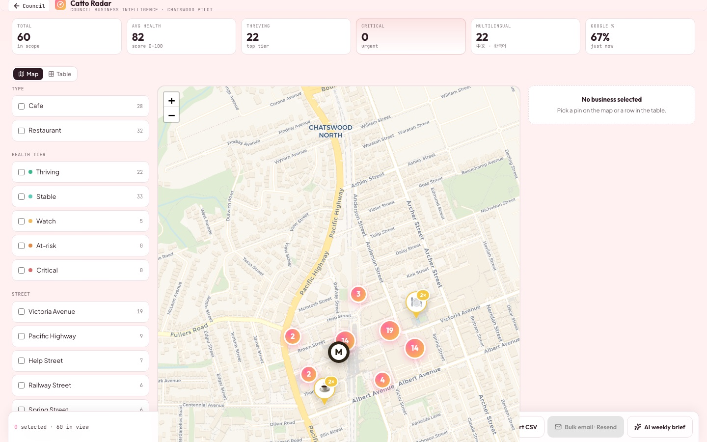
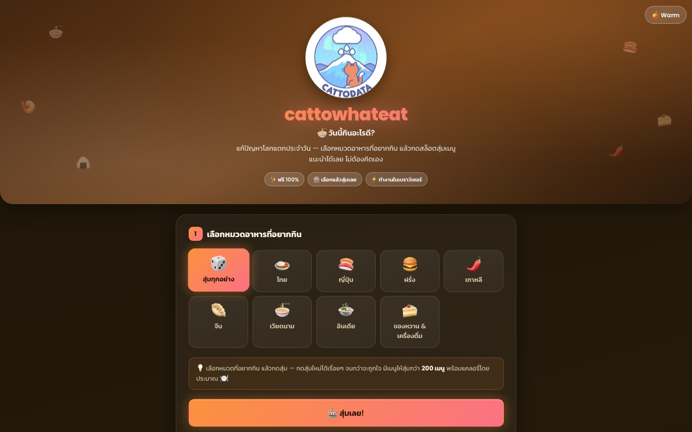
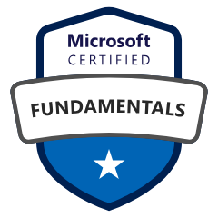

# Azure Data & AI Engineer · ex-Microsoft

### Production LLM applications · agentic workflows · RAG · enterprise data platforms

Enterprise Data & AI experience spanning customer-facing solution architecture at Microsoft and
hands-on delivery of production RAG, multi-agent systems, and enterprise data platforms.

**Sydney, Australia** · **Microsoft Certified Trainer** · **Azure Solutions Architect Expert** · **10× Azure certified** · **10+ years in tech**

**🏆 1st place — Chatswood AI Hackathon 2026** · **🏅 Microsoft Global Hackathon winner 2023**

---

# 🏆 Civic-Tech AI Copilot
### **CatWalk**

**★ 1st Place Winner — Chatswood "AI for Real-World Impact" Hackathon 2026**
Willoughby City Council × GEEQ

  

One app, three roles on the same data. Residents earn rewards for **GPS-geofenced** walks · shop
owners get **AI marketing campaigns in EN / 中文 / 한국어** generated from live weather, local events
and ABS census demographics · Council gets an **aggregate-only** movement and CO₂ dashboard.

  
  
  

`React 19` `TypeScript` `Supabase + RLS` `Leaflet / OpenStreetMap` `Azure OpenAI` `Azure App Service` `Playwright`

---

# 🚀 Projects

Independent AI products and applications I design and deliver, live on **[cattodata.com](https://cattodata.com)**.

<table>
<tr>
<td width="50%" valign="top">

### 🏆 Civic-Tech AI Copilot
**[CatWalk](https://github.com/cattodata/catwalk)** · 1st Place, Chatswood Hackathon 2026 · Live

A civic-engagement app with three roles on shared data: residents earn rewards for GPS-verified
walks to local shops, shop owners receive AI-generated marketing campaigns in three languages, and
Council views an aggregate-only movement and CO₂ dashboard. Source is public.

`React 19` `TypeScript` `Supabase + RLS` `Leaflet` `Azure OpenAI` `Azure App Service`

</td>
<td width="50%" valign="top">

### 💰 Privacy-First Finance Analytics
**[CattoExpense](https://cattodata.com/cattoexpense)** · cattodata.com · Live

Analyses Australian bank statements: PDF and CSV parsing, in-browser OCR, categorisation, spending
charts and month-over-month comparison, with Excel and PDF export. All processing runs client-side,
so statement data never leaves the browser.

`Client-side` `OCR` `Charts` `AI coaching`

</td>
</tr>
<tr>
<td width="50%" valign="top">

### 🚀 Migration & Relocation Intelligence
**[CattoGo](https://cattodata.com/cattogo)** · cattodata.com · Live

Relocation decision support for technology professionals. Models salary, tax, cost of living and
points-based visa eligibility across 16 countries, with an Australia life simulator. Figures are
sourced from ATO, ABS, OECD and Numbeo, and each is cited.

`Next.js` `Maps` `Modelling`

</td>
<td width="50%" valign="top">

### 🎓 Data & AI Learning Platform
**[CattoLearn](https://cattodata.com)** · cattodata.com · Live

Self-paced learning platform covering enrolment, progress tracking, quizzes, issued certificates,
editorial tooling and community, on a single Postgres schema. The largest codebase in this portfolio.

`Next.js` `Prisma` `Supabase` `NextAuth` `Tiptap` `OpenAI` `Cloudflare Workers` `Playwright`

</td>
</tr>
<tr>
<td width="50%" valign="top">

### ✈️ AI Trip Orchestrator
**[CattoTravel](https://cattodata.com/cattotravel)** · cattodata.com · Live

Ingests a trip plan in free text, PDF, Excel or Word and resolves it into dated time slots with
weather, maps, cost breakdown and export. Carries the most comprehensive automated test coverage
in this portfolio.

`LLM` `Itinerary` `Maps` `Export`

</td>
<td width="50%" valign="top">

### 🎁 Prize Draw & Lottery Tool
**[CattoLotto](https://cattodata.com/cattolotto)** · cattodata.com · Live

Runs prize draws from a pasted or uploaded list, supporting multiple prizes with no repeat winners.
Entirely client-side, with no account and no stored data.

`HTML` `JS` `Client-side`

</td>
</tr>
<tr>
<td width="50%" valign="top">

### 🌐 AI Book Translator (EN↔TH)
**[CattoTranslate](https://cattodata.com/cattotranslate)** · cattodata.com · Live

Translates complete PDF and EPUB books between English and Thai, maintaining document context
across chapters rather than translating in isolated chunks, and rebuilding the EPUB with its
original formatting.

`LLM translation` `EPUB` `EN↔TH`

</td>
<td width="50%" valign="top">

### 🍜 What-To-Eat Picker
**[CattoWhatEat](https://cattodata.com/cattolotto/cattowhateat/)** · cattodata.com · Live

A cuisine picker built as a single HTML file with no dependencies and no build step, with three
switchable themes. A sibling of CattoLotto.

`Vanilla JS` `Zero dependencies` `Single file`

</td>
</tr>
<tr>
<td width="50%" valign="top">

### 📖 Thai PDF → EPUB Converter
**[CattoEPUB](https://cattodata.com/cattoepub)** · cattodata.com · Live

Converts complex Thai PDFs, including scans, into readable EPUBs. Pages are batched to reduce OCR
token cost, repeated terms are held in a glossary, and partially processed documents can resume.
Runs client-side, with human review of the OCR output before export.

`OCR` `PDF.js` `PWA` `Client-side`

</td>
<td width="50%" valign="top">

</td>
</tr>
</table>

### Also built — source private

**Language-Learning Backend** · *English Buddy*
FastAPI backend for spoken-English practice. Speech is transcribed and force-aligned against a
reference recording, with prosody and phoneme accuracy scored separately. Comprehensive automated
test coverage, including an LLM output-quality evaluation gate and path-traversal protection on
audio file access.
`Python` `FastAPI` `STT/TTS` `forced alignment`

**Cross-Lingual Mnemonic Engine** · *MnemoAI*
Vocabulary app for Thai speakers learning Japanese. A phonetic engine finds Thai words that sound
like the Japanese target, an LLM composes a linking mnemonic, and a spaced-repetition scheduler
handles review. Uses HMAC-signed anonymous device tokens to mitigate IDOR risk without exposing
raw user identifiers. Layered service structure with Claude Haiku as primary provider and OpenAI
as fallback.
`Python` `FastAPI` `Postgres` `Redis` `Docker`

**Governed Text-to-SQL Data App** · *CattoGadget*
Databricks App answering Thai natural-language questions over governed tables via Genie
text-to-SQL. Sentiment analysis and classification run as AI functions within the SQL query rather
than as a separate model service. Writes to Lakebase Postgres use service-principal OAuth
authentication with no embedded credentials, and permissions are enforced through Unity Catalog.
`Python` `Databricks Apps` `Unity Catalog` `Lakebase` `Genie`

**AI Knowledge Feed** · *CattoFlip*
Personal knowledge app presenting articles as full-screen cards, with LLM summarisation,
read-aloud playback and spaced-repetition review. Ships to iOS and Android from a single React
codebase with in-app subscriptions. CI scans built artifacts for exposed secrets before release,
alongside automated test and build workflows.
`React` `Capacitor` `Supabase` `RevenueCat` `Claude API`

**Personality Synthesis App** · *CattoAstro*
Thai behavioural-profile application. Four independent inputs — Western astrology, BaZi,
numerology and Vedic charts — are computed separately, then synthesised by an LLM into a single
consolidated reading. Deployed on Azure Container Apps with Redis-backed edge rate limiting.
`Next.js` `Redis` `Azure Container Apps`

**AI Video Production Pipeline** · *CattoCreator*
Converts a news article into a rendered vertical video: script generation, voice synthesis and
programmatic rendering. Structured as a monorepo with two deployables sharing a single Azure
backend, so generation runs once rather than per client.
`Monorepo` `TTS` `Azure`

**Document Publishing Pipeline** · *CattoBook*
Produces an epubcheck-validated EPUB and a print-ready A5 PDF from a Markdown or Word source in a
single command. Typesetting is defined once as a reusable theme rather than per document.
`Node` `EPUB` `epubcheck`

**Conversation Summarisation Bot** · *CattoDiscord*
Discord bot that summarises long Thai-language conversation threads. Local-first design, running
against a development workspace before deployment to a live server.
`TypeScript` `Vercel Chat SDK` `AI SDK`

> Most product repositories are private; live demos and selected case studies are linked above.
> **[CatWalk](https://github.com/cattodata/catwalk)** is the public reference implementation, with
> its architecture, technical decisions and trade-offs written up in full.

---

# 🏅 Awards & scholarships

| | Award | Year |
|---|---|---|
| ★ | **1st Place — Chatswood "AI for Real-World Impact" Hackathon** Willoughby City Council × GEEQ. Won with CatWalk, an AI-enabled civic-engagement platform. | 2026 |
| ★ | **Microsoft Global Hackathon — Award Winner** Top-6 finalist in the ANZ region with a cross-functional global team. | 2023 |
| 🎓 | **HRH Princess Maha Chakri Sirindhorn Scholarship** Fully funded M.Sc. at UCD Ireland — 100% tuition plus living stipend, awarded to only two individuals annually. | 2017–2018 |

---

# 🧠 Skills

**AI Agents & Orchestration**
`Multi-agent systems (production)` `MCP — Model Context Protocol` `Tool calling` `Agent handoffs`
`Stateful conversation` `RAG (in production)` `Mosaic AI Agent Framework` `LangChain` `Agent observability & evals`

**Generative AI & LLMs**
`Anthropic Claude` `OpenAI GPT` `Google Gemini` `Azure OpenAI` `Prompt engineering`
`Fine-tuned LLM workflows` `Vector Search`

**Databricks** *(primary)*
`Lakehouse Platform` `Mosaic AI` `Genie Space` `Unity Catalog governance` `Delta Lake` `MLflow` `Spark / PySpark` `DBSQL`

**Azure & Cloud**
`Microsoft Fabric` `Azure AI Foundry` `Azure ML` `Synapse` `Cognitive Services` `Data Factory` `Power BI` `AWS`

**ML & MLOps**
`Full MLOps lifecycle` `Model serving` `TensorFlow` `PyTorch` `Docker` `Azure DevOps` `CI/CD`

**Development Tooling**
`Claude Code` `GitHub Actions` `Playwright` `Docker` `Vercel`

**Data & App Stack**
`SAP HANA → Snowflake migration` `Data modelling` `ELT pipelines` `Python` `SQL / PL-SQL`
`Next.js 15` `Supabase (pgvector)` `FastAPI` `TypeScript`

---

# 📜 Background

**Now** — Data & AI Engineer, Sydney · Azure data platforms end to end: ingestion, ELT, lakehouse, AI-powered analytics
**Microsoft** — Azure Data & AI Specialist · enterprise data strategy, solution architecture, AI roadmaps
**Fortune 500 energy** — Analytics Data Design Lead → ML Engineer · cloud data-warehouse migration, onsite year in Houston 🇺🇸
**Tohoku University 🇯🇵** — Special Researcher (JASSO residency) · NLP research, 6 peer-reviewed publications

**Education** — M.Sc. Data Science, University College Dublin 🇮🇪 (HRH Princess Maha Chakri Sirindhorn royal scholarship) · M.Sc. Natural Language Processing & Information Retrieval 🇹🇭

---

# 🎖️ Certifications

**Microsoft Certified Trainer (MCT)** — 2024 to present · authorised to deliver official Azure & AI training and curriculum

| | Certification | Exam | Level |
|---|---|---|---|
|  | [Azure Solutions Architect Expert](https://learn.microsoft.com/en-us/credentials/exams/az-305/) | AZ-305 | **Expert** |
|  | [Azure Databricks Data Engineer Associate](https://learn.microsoft.com/en-us/credentials/certifications/implementing-data-engineering-solutions-using-azure-databricks/) | DP-750 | Associate |
|  | [Azure AI Engineer Associate](https://learn.microsoft.com/en-us/credentials/certifications/azure-ai-engineer/) | AI-102 | Associate |
|  | [Azure Data Engineer Associate](https://learn.microsoft.com/en-us/credentials/certifications/azure-data-engineer/) | DP-203 | Associate |
|  | [Fabric Data Engineer Associate](https://learn.microsoft.com/en-us/credentials/certifications/fabric-data-engineer-associate/) | DP-700 | Associate |
|  | [Fabric Analytics Engineer Associate](https://learn.microsoft.com/en-us/credentials/certifications/fabric-analytics-engineer-associate/) | DP-600 | Associate |
|  | [Azure Data Scientist Associate](https://learn.microsoft.com/en-us/credentials/certifications/azure-data-scientist/) | DP-100 | Associate |
|  | [Azure AI Fundamentals](https://learn.microsoft.com/en-us/credentials/certifications/azure-ai-fundamentals/) | AI-900 | Fundamentals |
|  | [Azure Data Fundamentals](https://learn.microsoft.com/en-us/credentials/certifications/azure-data-fundamentals/) | DP-900 | Fundamentals |
|  | [Azure Fundamentals](https://learn.microsoft.com/en-us/credentials/certifications/azure-fundamentals/) | AZ-900 | Fundamentals |

**Other** — Databricks Certified: Generative AI · Azure Databricks CSA Technical Training ·
Anthropic Certified: Claude 101 · AWS Certified Cloud Practitioner ·
Microsoft OpenHack: Cloud Data Warehousing · dbt Fundamentals · SQL (Advanced) HackerRank ·
Snowflake Hands-on Essentials

---

# ✍️ Writing

I write about the systems I build at **[cattodata.com/blog](https://cattodata.com/blog)** — RAG and
its advanced retrieval techniques, Azure OpenAI integration, the X recommendation algorithm, LLM
tooling, and getting started on Azure. 17 technical articles in total, including work as an invited
guest author on **DataTH**, Thailand's largest data community.

Lived and worked across 🇹🇭 Thailand · 🇯🇵 Japan · 🇮🇪 Ireland · 🇺🇸 United States · 🇦🇺 Australia
Languages: English · Thai · Japanese

---

### Let's talk.
Open to Data, AI and Generative AI engineering roles.

[cattodata.com](https://cattodata.com) · [Blog](https://cattodata.com/blog) · [Case studies](https://github.com/cattodata/portfolio)

